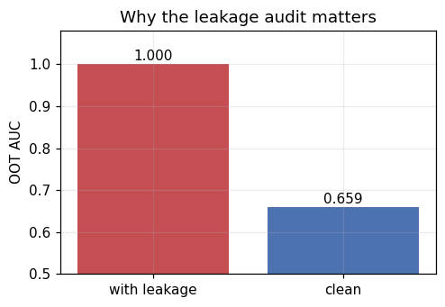
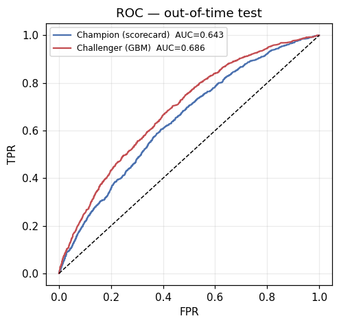
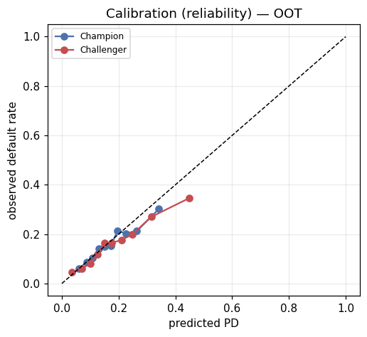
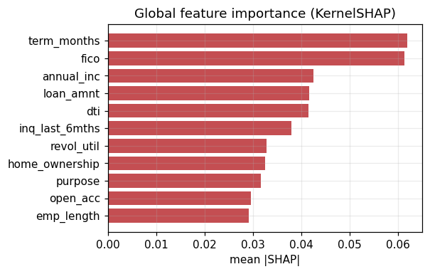
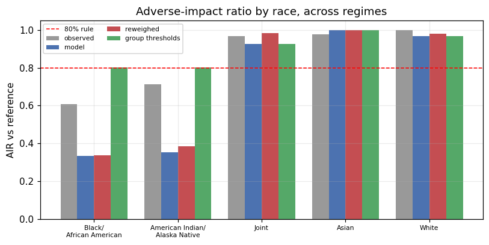

# Credit Risk Probability-of-Default Modeling & Independent Model Validation

**An end-to-end, explainable probability-of-default (PD) model built on real Lending Club loans, then independently validated against the Federal Reserve's SR 11-7 model-risk standard — with a parallel fair-lending audit on mortgage (HMDA) data.**

This project is framed as a *dual-hat* exercise: I act first as the **model developer** who builds the credit-scoring models, then as the **independent validator** (second line of defense) who interrogates those models and issues a formal findings report. The validation report — not the model — is the headline deliverable, because in a real bank the thing that separates a credit risk *analyst* from someone who can merely train a classifier is the ability to judge whether a model can be trusted.

> **Data provenance.** The PD model runs on **real Lending Club data** (`accepted_2007_to_2018Q4`, ~2.26M loans, sampled to 250K). The fair-lending module currently runs on **synthetic HMDA data** as a methodology demonstration; it becomes real the moment a real HMDA slice is dropped in. Every number below is reproducible from `python src/run_pipeline.py`.

---

## Table of contents
1. [The problem (the question)](#1-the-problem)
2. [Why it matters](#2-why-it-matters)
3. [The approach](#3-the-approach)
4. [The data](#4-the-data)
5. [Deep dives](#5-deep-dives)
6. [Key insights](#6-key-insights)
7. [Recommendations](#7-recommendations)
8. [Limitations](#8-limitations)
9. [Conclusion](#9-conclusion)
10. [Repository & how to run](#10-repository--how-to-run)

---

## 1. The problem

**The core question: given a loan applicant, what is the probability they will default — and can we trust that estimate enough to lend on it, price it, and stay within the law?**

Every lending decision reduces to estimating one number, the **probability of default (PD)**, and then acting on it. But a usable answer is not just "a model with high accuracy." A credit model has to clear three very different bars at once:

- It must **rank** applicants well (separate likely-defaulters from likely-payers).
- Its predicted probabilities must be **calibrated** (a "15% PD" should actually default ~15% of the time), because those numbers set interest rates and loss reserves.
- It must be **explainable and fair** — regulators require that declined applicants be told why, and that the model not discriminate against protected groups, even unintentionally.

A model can pass one of these and fail another. The interesting question this project answers is not "can I predict default?" but **"is this model actually fit to be used, and where does it break?"**

## 2. Why it matters

Credit risk modeling is one of the highest-stakes applications of data science:

- **Money.** PD feeds the master credit equation, **Expected Loss = PD × LGD × EAD**. A mis-estimated PD means mispriced loans and wrong loss reserves — directly hitting profitability and capital adequacy.
- **Regulation.** Bank models are governed by **SR 11-7** (Fed/OCC model-risk guidance), which mandates independent validation, and by **ECOA / Regulation B**, which gives consumers a right to the reasons behind a denial. Fair-lending law adds **disparate-impact** liability even where no protected attribute is used.
- **People.** These decisions determine who gets access to credit. Getting them wrong — or getting them subtly discriminatory — causes real harm, as the 2008 crisis demonstrated at scale.

That combination of financial, regulatory, and ethical stakes is exactly why the *validation* discipline exists, and why this project centers it.

## 3. The approach

**A dual-hat workflow, two datasets, and a champion-vs-challenger design.**

- **Two datasets, two competencies.** No single public dataset supports both tasks: Lending Club has loan *outcomes* but no demographics (so it carries the PD model), while HMDA has applicant *demographics* and the approve/deny decision but no default outcome (so it carries the fairness audit). Treating them as two honest modules is itself a demonstration of understanding the data's limits.
- **Champion vs. challenger.** An interpretable **Weight-of-Evidence (WOE) scorecard** — the regulator-familiar incumbent — is benchmarked against a **gradient-boosting challenger** with monotonic constraints and probability calibration. The question is whether the more powerful model is actually *better* once all three bars are applied.
- **Three metric families.** Every model is judged on **discrimination** (AUC, Gini, KS), **calibration** (Hosmer-Lemeshow, Brier), and **stability** (PSI) — because reporting only AUC is the classic junior mistake.
- **Explainability & fairness.** SHAP attributions, ECOA adverse-action reason codes, a conceptual-soundness cross-check, and a full disparate-impact analysis.
- **The deliverable.** All of it culminates in an SR 11-7 validation report with severity-rated findings and an explicit approve/reject opinion.

## 4. The data

The PD model uses the public **Lending Club** loan book (2007–2018, ~2.26M originations), cleaned and sampled to **250,000 loans** from 2014–2018, of which **~137,600 are resolved** (matured to Fully Paid or Charged Off) and thus usable for modeling. The overall **default rate is 20.8%**.

Three data decisions do most of the work:

- **Target definition.** `default = 1` for charged-off/defaulted loans, `0` for fully-paid; loans still in progress are dropped (their outcome is unknown and would corrupt the labels).
- **Leakage audit.** Post-origination fields (recoveries, total payments, etc.) are removed because they encode the outcome. The project *proves* why with a demonstration: a model that includes those fields scores a near-perfect **AUC of 1.00**, versus **0.66** for the clean model — the unmistakable signature of leakage.

  

- **Out-of-time validation.** Data is split by origination *year* (train 2014–16, validate 2017, hold out 2018), not randomly — because credit data drifts over time and a random split would leak the future into the past.

## 5. Deep dives

### 5.1 Champion — Weight-of-Evidence scorecard
The scorecard bins each feature, transforms it to Weight of Evidence, ranks features by **Information Value**, fits a logistic regression, and scales the result to points. It is fully transparent: every applicant's score decomposes into per-feature point contributions. Credit score, revolving utilization, and debt-to-income consistently carry the most signal (see `reports/figures/03_iv_ranking.png`).

### 5.2 Challenger — calibrated, monotonic gradient boosting
The challenger is a gradient-boosted tree ensemble with two credit-specific constraints: **monotonicity** (risk is forced to move in the economically correct direction for each feature) and **isotonic calibration** (so its outputs are usable probabilities, not just rankings). SMOTE and other synthetic oversampling were deliberately avoided because they distort the base rate and destroy calibration.

### 5.3 Discrimination — can the models rank risk?

| Metric | Champion (scorecard) | Challenger (GBM) |
|---|---|---|
| AUC | 0.643 | **0.686** |
| Gini | 0.286 | **0.371** |
| KS | 0.213 | **0.267** |

The challenger wins on every discrimination measure. An AUC in the high-0.60s is realistic for an underwriting-only model on real, noisy data — and a believable result (an AUC above ~0.85 would itself signal leakage).



### 5.4 Calibration — are the predicted probabilities trustworthy?

| Metric | Champion | Challenger |
|---|---|---|
| Brier score | 0.131 | 0.129 |
| Hosmer-Lemeshow χ² | 20.6 | 57.4 |
| HL p-value | 0.008 → **FAIL** | ~0.000 → **FAIL** |

**This is the project's headline finding.** *Both* models fail the calibration test — and the higher-AUC challenger is the **worse**-calibrated of the two. Better ranking did not translate into trustworthy probability *levels*. The challenger is preferable for accept/decline ranking, but **neither model is fit for risk-based pricing or loss provisioning without recalibration.**



### 5.5 Stability — is the population still the one we trained on?

| Quantity | PSI (train → OOT) | Reading |
|---|---|---|
| Model score | 0.057 | stable |
| Debt-to-income | 0.043 | stable |
| FICO | **0.164** | **moderate shift** |

The model's *output* is stable, but a key *input* — FICO — has drifted moderately between the training and hold-out periods. This is the early-warning pattern (input drift precedes output drift) and, together with a default-rate shift from 20.6% (train) to 16.2% (out-of-time), helps explain the calibration breakdown: a probability map fit on one period does not transfer cleanly to a shifted one.

### 5.6 Explainability & adverse-action reason codes
SHAP (implemented from first principles and verified to satisfy the efficiency property) identifies the global drivers and, for any individual applicant, the top reasons behind their score — which map directly to **ECOA/Reg B adverse-action reasons** (e.g. "revolving utilization too high," "credit score below approved-applicant norms"). The scorecard produces the same reasons via points-below-maximum. A conceptual-soundness check confirms the model's feature effects agree with economic theory on all material drivers.



### 5.7 Fair-lending audit (HMDA) — *synthetic data; methodology demonstration*
Switching hats, this module audits a lending *decision* for disparate impact.

- **Observed disparity.** Adverse-impact ratios fall below the 80% (four-fifths) threshold for some groups, flagging prima-facie disparate impact.
- **The central finding — "fairness through unawareness" fails.** A model trained on *legitimate underwriting features only*, with no protected attribute, still produces a minimum adverse-impact ratio of **0.33** — well under the 0.80 threshold. Because the legitimate features are correlated with group membership, excluding the protected attribute does not remove the disparity; it launders it through proxies.
- **Mitigations and their cost.** Reweighing barely moved the disparity (too weak against strong proxy structure), while group-specific thresholds *did* lift the minimum AIR to ~0.80 — but applying different cutoffs by protected group is itself a **disparate-treatment** concern, generally impermissible in US credit. The lever that fixes disparate *impact* creates disparate *treatment*; the bias is structural.



## 6. Key insights

1. **Discrimination ≠ calibration, and a higher AUC does not mean a better model.** The single most important takeaway: the challenger ranked better yet was less trustworthy on probabilities. A team that chose it on AUC alone would have shipped a worse-calibrated model into pricing.
2. **Calibration is fragile to population shift.** The train→out-of-time default-rate move (20.6% → 16.2%) and FICO drift broke calibration for both models — exactly the kind of failure that AUC hides and that ongoing monitoring must catch.
3. **"Just don't use race" is not a fairness solution.** Proxy correlations reproduce disparate impact even when protected attributes are excluded — and the effective mitigation (group thresholds) is the legally fraught one.
4. **Leakage and survivorship are where credit models quietly die.** The leakage demo (AUC 1.00 vs 0.66) and the maturity/reject-inference caveats matter more than squeezing out a few points of AUC.

## 7. Recommendations

- **Do not use either model for risk-based pricing or expected-loss provisioning until recalibrated.** Use the challenger for accept/decline ranking in the interim.
- **Investigate and monitor the population shift.** Put FICO on a PSI watchlist with a recalibration trigger; re-fit the calibration layer on a more recent window.
- **Treat the fair-lending result as a real risk, not a checkbox.** Run a formal disparate-impact and less-discriminatory-alternative analysis on *real* HMDA data; do not rely on feature exclusion as a control.
- **Address survivorship before production.** The model is trained on approved loans only; a reject-inference study (or an explicit management overlay) is required before through-the-door deployment.
- **Re-validate on a fully-matured vintage split** to remove the maturity bias in the 2017–18 hold-out.

## 8. Limitations

- **Fair-lending runs on synthetic HMDA data** — those conclusions are methodological until a real slice is loaded.
- **Vintage maturity / survivorship** — 2017–18 hold-out loans are partly immature in the data snapshot, biasing out-of-time results.
- **Flat LGD (55%)** — expected-loss figures are directionally indicative; a production model would estimate LGD separately.
- **No macroeconomic overlay** — this is a point-in-time model; lifetime ECL (CECL/IFRS-9) would require forward macro scenarios.
- **Reject inference unaddressed** — training observes approved loans only.
- **Library substitutions** — SHAP, the WOE binning, the gradient-boosting model, p-values, and fairness mitigations are first-principles implementations so the project runs anywhere; canonical packages should replace them on production infrastructure.

## 9. Conclusion

Starting from one question — *can we trust a PD estimate enough to lend, price, and stay compliant?* — this project builds two competing models, evaluates them across discrimination, calibration, and stability, explains their decisions, audits them for fairness, and validates the whole thing under SR 11-7.

The honest answer the analysis produces is nuanced, which is the point: the challenger model **ranks credit risk better but is not yet trustworthy enough to set prices**, both models need recalibration before level-dependent use, and fairness cannot be assumed away by hiding protected attributes. Surfacing those conclusions — rather than reporting a single flattering accuracy number — is exactly what independent model validation is for, and what a credit risk analyst is paid to do.

The full, formal write-up with severity-rated findings is in **[`reports/validation_report.md`](reports/validation_report.md)**.

---

## 10. Repository & how to run

```
credit-risk-pd-validation/
├── data/                       # real CSVs go here (git-ignored; see below)
├── src/                        # the analytical engine
│   ├── data.py                 # target definition, leakage audit, OOT split, loaders
│   ├── scorecard.py            # WOE/IV scorecard (champion)
│   ├── challenger.py           # monotonic, calibrated gradient boosting (challenger)
│   ├── metrics.py              # discrimination / calibration / stability / expected loss
│   ├── explain.py              # KernelSHAP, reason codes, conceptual soundness
│   ├── fairness.py             # adverse-impact ratio, equal opportunity, mitigations
│   └── run_pipeline.py         # one-command runner → figures + results.json
├── scripts/
│   ├── prepare_lending_club.py # clean the raw Lending Club file into model schema
│   └── generate_report.py      # build validation_report.md from results.json
├── notebooks/credit_pd_validation.ipynb   # interactive walkthrough
├── reports/
│   ├── figures/                # 11 generated figures
│   ├── results.json            # all computed metrics (source of truth)
│   └── validation_report.md    # ← the headline SR 11-7 deliverable
├── GUIDE.md                    # a build-it-yourself teaching manual
└── requirements.txt
```

**Run it:**
```bash
python -m venv .venv && source .venv/bin/activate     # Windows: .venv\Scripts\activate
pip install -r requirements.txt
python src/run_pipeline.py        # regenerates all figures + results.json
python scripts/generate_report.py # rebuilds the validation report from results.json
```

**Use real data:**
- *Lending Club*: download the historical loan file (e.g. the Kaggle "Lending Club Loan Data" mirror) and run `python scripts/prepare_lending_club.py <path-to-accepted_*.csv.gz>`, which writes `data/lending_club.csv`.
- *HMDA*: from the [FFIEC Data Browser](https://ffiec.cfpb.gov/data-browser/), export one state, 2024, first-lien owner-occupied 1–4 family conventional purchase loans, and save as `data/hmda_2024.csv`.

Data files are git-ignored (large and/or licensed); the pipeline regenerates everything from them on demand.

---

*New to the codebase? `GUIDE.md` walks through the credit-risk math and builds the project step by step. The dual-hat developer/validator split is a project framing device; in a production setting these functions must be organizationally separate.*
