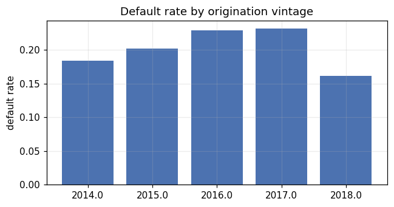
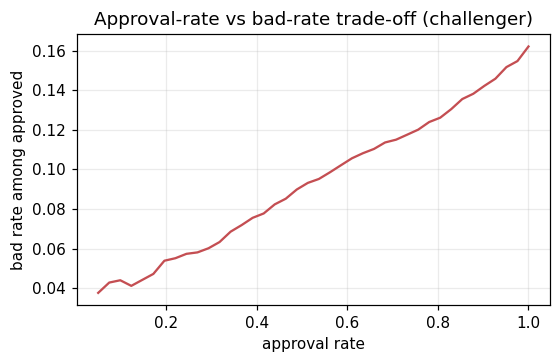
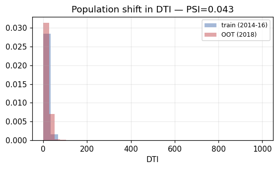
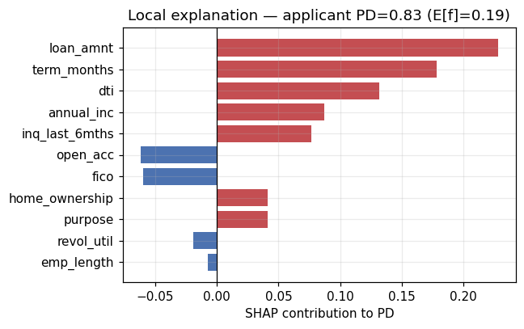
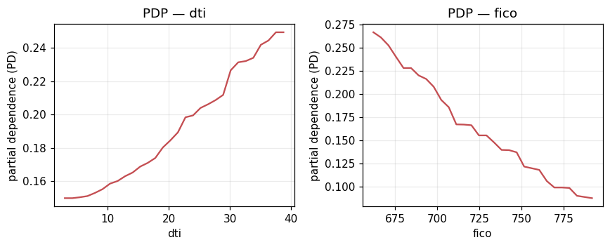

# Independent Model Validation Report
## Consumer Probability-of-Default (PD) Scorecard & Machine-Learning Challenger

| | |
|---|---|
| **Model ID** | PD-RETAIL-2026-01 |
| **Model name** | Unsecured Consumer Loan PD Model (Underwriting) |
| **Model type** | Binary classification — probability of default over loan term |
| **Champion** | Logistic-regression WOE scorecard |
| **Challenger** | Gradient-boosted trees, monotone-constrained, isotonic-calibrated |
| **Validation standard** | SR 11-7 (Federal Reserve / OCC Model Risk Management) |
| **Report date** | 2026-06-05 |
| **Validator** | Independent Model Validation (second line) |
| **Overall opinion** | **Approve with conditions** — see findings (Section 10) |

> **Data provenance.** The Lending Club PD data is **real** (loaded from `data/lending_club.csv`); the HMDA fair-lending data is still **synthetic** (no `data/hmda_2024.csv` present), so Section 7 is illustrative of method only. Drop a real HMDA slice in to make it real. This report is generated directly from `reports/results.json`; re-run `python src/run_pipeline.py` then `python scripts/generate_report.py` to refresh every number here.

---

## 1. Executive Summary & Model Overview

The model estimates the probability that a consumer loan applicant defaults over the life of the loan. It supports three uses with different accuracy needs: accept/decline decisioning (needs rank-ordering), risk-based pricing, and expected-loss provisioning (both need calibrated PD *levels*).

**Materiality / model-risk rating: HIGH.** The model drives credit-granting decisions and loss provisioning on a portfolio of roughly $101,648,675 exposure in the validation sample, produces consumer-facing adverse-action decisions under ECOA / Regulation B, and feeds financial reserves.

**Champion vs. challenger.** The challenger is the stronger model on discrimination (out-of-time AUC 0.686 challenger vs 0.643 champion, a 0.043 difference). On expected loss the champion is lower ($12,042,007 vs $10,483,812, a -14.9% difference on the validation sample). **Both models fail the Hosmer-Lemeshow test** (champion p=0.0082, challenger p=0.0000). The challenger posts the higher AUC yet is the *worse*-calibrated of the two. This is the discrimination-vs-calibration trade-off in the open: better rank-ordering does not imply trustworthy probability *levels*. Neither model is calibration-adequate on the out-of-time sample, so neither may feed risk-based pricing or ECL provisioning without recalibration; the challenger remains preferred for rank-ordering / decisioning. A likely driver is the train→OOT population shift (training default rate 20.6% vs out-of-time 16.2%): a calibration map fit on the training vintages does not transfer cleanly to a shifted hold-out period.

### Summary of findings

| ID | Finding | Severity |
|----|---------|----------|
| F-1 | Both models fail Hosmer-Lemeshow on the OOT sample (champion p=0.0082, challenger p=0.0000); the higher-AUC challenger is the worse-calibrated. Neither is pricing/ECL-ready without recalibration | **High** |
| F-2 | Fair-lending audit runs on synthetic HMDA data; conclusions are methodological until a real HMDA slice is loaded | **Medium** |
| F-3 | Fair-lending: a model on legitimate features only reproduces disparate impact via proxies (min AIR 0.33) | **Medium** |
| F-4 | FICO shows a moderate shift train→OOT (PSI=0.164) | **Medium** |
| F-5 | Out-of-time vintages (2017–18) are partly immature in the data snapshot; OOT performance carries a maturity/survivorship bias | **Medium** |
| F-6 | Reject inference not addressed — training observes approved loans only (survivorship bias) | **Low** |

---

## 2. Conceptual Soundness

Both model forms are standard for retail PD. The WOE scorecard is the regulator-familiar, coefficient-interpretable incumbent; gradient-boosted trees are an appropriate challenger because the risk surface is non-linear with interactions a linear-in-WOE model cannot capture.

**Variable selection.** The model uses underwriting-time features only. The lender's own assessment (`grade`, `sub_grade`, `int_rate`) was **excluded** — including it would model the originator's pricing policy rather than raw creditworthiness and create circularity. Correct call.

**Monotonicity.** Economic priors were imposed as hard constraints on the challenger; empirical sweeps confirm every constrained feature is honored (8/8 verified).

**Key weakness — reject inference.** Training observes approved-and-booked loans only, a selected sample; PD does not extend cleanly to the reject region. Acceptable for a portfolio piece if stated; production needs a reject-inference study or management overlay.

---

## 3. Data Review

**Target definition.** `default=1` for charged-off/defaulted, `0` for fully-paid; unresolved loans dropped (112,432 rows: 108,166 Current, 2,705 Late (31-120 days), 1,022 In Grace Period, 539 Late (16-30 days)). Of 250,000 rows, **137,568** were kept at a **20.82%** default rate.

**Leakage audit — passed.** 7 post-origination / outcome-encoding fields were dropped. A deliberate leakage demonstration shows a model *with* those fields scoring **AUC 1.00** versus **0.66** clean — the signature of leakage, and the audit trail a validator wants.

**Out-of-time design.** Split by origination vintage: **train 109,662** / **validation 21,003** / **out-of-time test 6,903**, with default rates 20.6% → 23.2% → 16.2%. Temporal splitting is the honest design for credit; a random split would leak future information.

---

## 4. Outcomes Analysis (Discrimination, Calibration, Business)

All metrics are on the **out-of-time** sample.

### Discrimination

| Metric | Champion | Challenger |
|---|---|---|
| AUC-ROC | 0.643 | 0.686 |
| Gini | 0.286 | 0.371 |
| KS | 0.213 | 0.267 |

### Calibration

| Metric | Champion | Challenger |
|---|---|---|
| Brier | 0.1315 | 0.1293 |
| Hosmer-Lemeshow χ² | 20.63 | 57.39 |
| HL p-value | 0.0082 (FAIL) | 0.0000 (FAIL) |

**Both models fail the Hosmer-Lemeshow test** (champion p=0.0082, challenger p=0.0000). The challenger posts the higher AUC yet is the *worse*-calibrated of the two. This is the discrimination-vs-calibration trade-off in the open: better rank-ordering does not imply trustworthy probability *levels*. Neither model is calibration-adequate on the out-of-time sample, so neither may feed risk-based pricing or ECL provisioning without recalibration; the challenger remains preferred for rank-ordering / decisioning. A likely driver is the train→OOT population shift (training default rate 20.6% vs out-of-time 16.2%): a calibration map fit on the training vintages does not transfer cleanly to a shifted hold-out period.

### Business view

Expected loss (PD × LGD × EAD, LGD 55%) on the OOT sample: **$10,483,812** champion vs **$12,042,007** challenger — a -14.9% difference against portfolio EAD of $101,648,675. The approval-vs-bad-rate curve lets the business pick a cutoff.

---

## 5. Stability & Ongoing Monitoring

Population Stability Index, train → OOT:

| Quantity | PSI | Band |
|---|---|---|
| DTI | 0.043 | stable |
| FICO | 0.164 | moderate shift |
| Model score | 0.057 | stable |

The model output remains stable (score PSI 0.057), but a key input is drifting — the early-warning pattern where input drift precedes output drift.

**Monitoring triggers:** PSI on every input and on the score monthly (investigate 0.10, recalibrate 0.25); discrimination on each maturing vintage; calibration (Hosmer-Lemeshow / observed-vs-expected) quarterly — the trigger that catches the Section 4 calibration finding.

---

## 6. Explainability & Conceptual Checks

**Global drivers.** SHAP (model-agnostic KernelSHAP, verified to satisfy the efficiency property) ranks the top drivers as **term_months** (0.062), **fico** (0.061), **annual_inc** (0.043), **loan_amnt** (0.042), **dti** (0.042). This aligns with the scorecard's Information-Value ranking, evidence both models key on the same economically sensible signals.

**Adverse-action reason codes (ECOA / Reg B).** For the highest-risk applicant the top PD-increasing SHAP contributors map to decline reasons "Requested loan amount high relative to profile"; "Loan term elevates risk"; "Debt-to-income ratio too high". The scorecard yields the same top reasons via points-below-maximum.

**Conceptual-soundness cross-check.** Sign agreement across challenger, champion, and economic theory holds for 7/9 numeric features. Disagreements are confined to weak/low-IV features (revol_util, open_acc), where attribution direction is statistically unstable and not relied upon. No *material* driver disagrees with theory.

---

## 7. Fair-Lending Analysis (HMDA Module) *(synthetic HMDA — methodological demonstration; load a real slice to make these real.)*

Separate data, separate competency: auditing a lending **decision** for disparate impact. Lending Club has outcomes but no demographics; HMDA has demographics and the approve/deny decision but no default outcome (denial rate 60.3%).

**Observed adverse-impact ratios** (group approval rate ÷ reference 'Joint'):

| Group | Approval rate | AIR | 80% rule |
|---|---|---|---|
| Joint | 42.9% | 1.00 | pass |
| White | 42.7% | 0.99 | pass |
| Asian | 42.0% | 0.98 | pass |
| American Indian or Alaska Native | 30.5% | 0.71 | **FAIL** |
| Black or African American | 27.0% | 0.63 | **FAIL** |

Groups failing the four-fifths rule: American Indian or Alaska Native, Black or African American.

**Fairness through unawareness fails (key finding).** A model trained on legitimate underwriting features only — no protected attribute — still produces a minimum AIR of **0.33** (AUC 0.680), failing the 80% rule. The legitimate features proxy for group membership, so excluding the protected attribute launders the disparity rather than removing it.

**Group fairness gaps (baseline):** equal-opportunity (TPR) 0.129, predictive-parity (precision) 0.115, FPR 0.248.

**Mitigations and their cost.** Reweighing (Kamiran-Calders) moved minimum AIR to **0.34** at near-zero AUC cost (0.679) — too weak to overcome proxy structure. Group-specific thresholds lifted minimum AIR to **0.80** (approval 24.6% → 27.3%) — effective, but applying different thresholds by protected group is itself a disparate-treatment concern, generally impermissible in US credit. The lever that fixes disparate *impact* creates disparate *treatment*; the bias is structural.

---

## 8. Limitations & Assumptions

1. **Synthetic data** (HMDA): those results are illustrative of method until real files are loaded.
2. **Vintage maturity / survivorship**: 2017–18 hold-out loans are partly immature in the snapshot, biasing OOT performance and calibration; a fully-matured-vintage split would sharpen this.
3. **Reject inference**: training observes approved loans only.
4. **Flat LGD (55%)**: expected-loss figures are directionally indicative; a real model estimates LGD separately.
5. **No macro overlay**: point-in-time model; lifetime ECL (CECL/IFRS-9) needs a forward macro scenario.
6. **Library substitutions**: SHAP, scorecard binning, the GBM, Wald p-values and fairness mitigations are first-principles implementations (see README); swap in canonical packages on production infrastructure.

---

## 9. Implementation Testing

**Reproducibility passed.** An independent re-fit re-scored the OOT sample at AUC 0.6856 versus reported 0.6856 — match to reported precision. The pipeline regenerates all figures and `results.json` deterministically from `python src/run_pipeline.py`; this report regenerates from that JSON.

Because core algorithms are bespoke re-implementations, implementation testing must be repeated on the production stack after swapping in canonical libraries.

---

## 10. Findings & Recommendations

| ID | Severity | Finding | Recommendation |
|----|----------|---------|----------------|
| F-1 | **High** | Both models fail Hosmer-Lemeshow on the OOT sample (champion p=0.0082, challenger p=0.0000); the higher-AUC challenger is the worse-calibrated. Neither is pricing/ECL-ready without recalibration | Recalibrate before any pricing/ECL use; prefer the challenger for rank-ordering. Investigate the train→OOT population shift. |
| F-2 | **Medium** | Fair-lending audit runs on synthetic HMDA data; conclusions are methodological until a real HMDA slice is loaded | Address in next iteration / add to monitoring. |
| F-3 | **Medium** | Fair-lending: a model on legitimate features only reproduces disparate impact via proxies (min AIR 0.33) | Run a formal disparate-impact + less-discriminatory-alternative analysis on real HMDA; do not treat feature exclusion as a control. |
| F-4 | **Medium** | FICO shows a moderate shift train→OOT (PSI=0.164) | Address in next iteration / add to monitoring. |
| F-5 | **Medium** | Out-of-time vintages (2017–18) are partly immature in the data snapshot; OOT performance carries a maturity/survivorship bias | Re-validate on a fully-matured-vintage split; note bias in monitoring. |
| F-6 | **Low** | Reject inference not addressed — training observes approved loans only (survivorship bias) | Document; track. |

**Validator's opinion: approve with conditions.** The challenger outperforms on discrimination. Neither model is calibration-adequate on the out-of-time sample, so neither may feed pricing/ECL until recalibrated; the challenger is preferred for rank-ordering/decisioning in the interim. Fair-lending findings must be cleared on real HMDA data before production. Results on synthetic data may not go to production until reproduced on real data.

---

## 11. Governance

| Role | Assignment |
|---|---|
| Model owner (first line) | Credit Risk Modeling — owns F-findings on the model |
| Independent validator (second line) | Model Validation — author; did not build the model |
| Compliance / Fair-lending | Owns the HMDA disparate-impact findings |
| Approver | Model Risk Committee |
| Review frequency | Annual revalidation; quarterly performance/calibration monitoring; event-driven on PSI ≥ 0.25 |

*Generated from `reports/results.json`. The dual-hat developer/validator split is a project framing device; in production these must be organizationally separate.*
